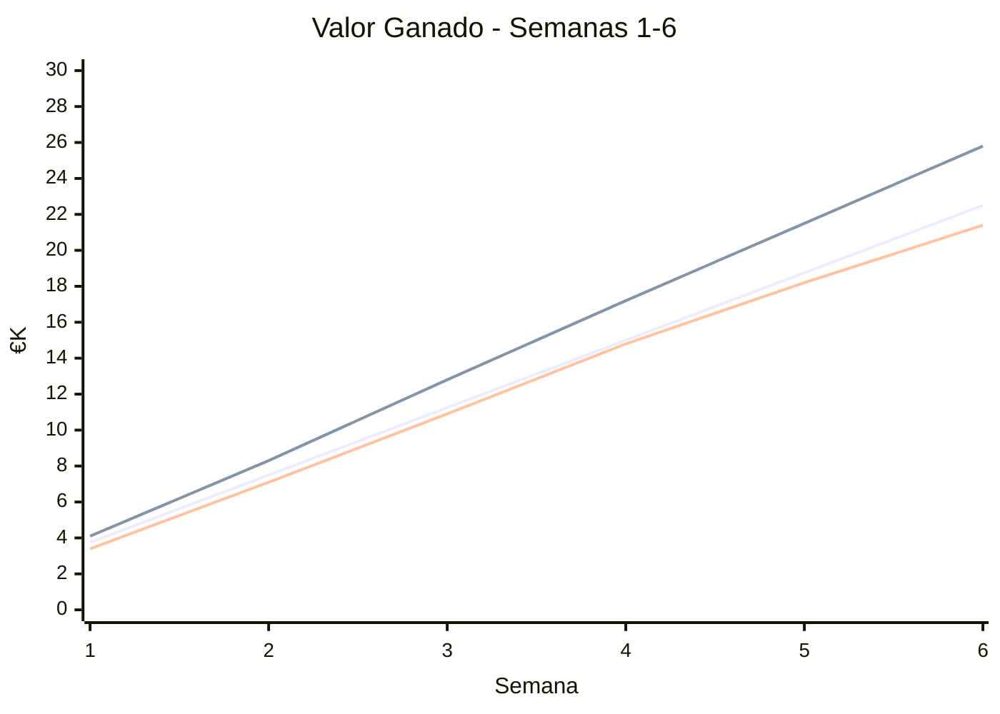

# 📊 Informe de Estado - Biblioteca Digital v1.0
*Semana 6 | Sprint 3 | Actualizado: 15/06/2026*

---

## 🚦 Resumen Ejecutivo (30 segundos)

| Indicador | Estado | Mensaje Clave |
|-----------|--------|--------------|
| **📅 Cronograma** | 🟡 En seguimiento | Vamos 5% más lentos, recuperable con ajuste de 2 tareas |
| **💰 Presupuesto** | 🟡 Atención | Gastamos 15% más, pero la tendencia se estabiliza |
| **🎯 Alcance** | 🟢 En camino | 95% de criterios de aceptación cumplidos |
| **🧪 Calidad** | 🟢 Estable | 0 bugs críticos, cobertura de tests 84% |

**Estado General**: 🟡 **En seguimiento con acciones correctivas**

---

## 📈 Curva S - Progreso vs. Plan

🔍 Lectura rápida:
🔴 AC sobre PV → Gastamos ~15% más de lo planificado
🟢 EV cerca de PV → Progreso real casi según lo previsto
📊 CPI = 0.83, SPI = 0.95 → Eficiencia aceptable con margen de mejora
