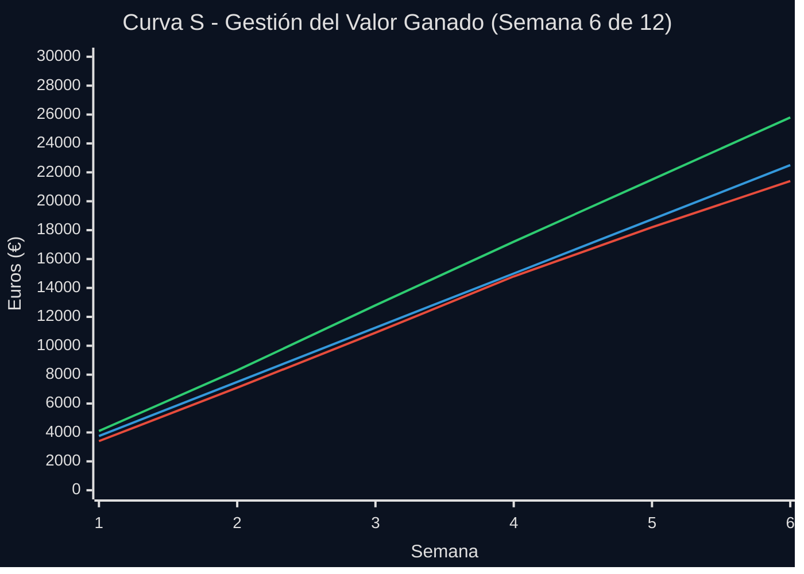

## 🗣️ Guion para Presentar la Curva S

### Apertura (5 segundos)
"Este gráfico muestra dónde estamos vs. dónde deberíamos estar."

### Lectura Visual (15 segundos)
• "La línea azul es nuestro plan original."
• "La roja es lo que hemos gastado: estamos ~15% por encima."
• "La verde es el valor que hemos entregado: vamos casi en plazo."

### Conclusión Accionable (10 segundos)
"Traducción: Necesitamos ajustar 2-3 tareas para mantener la fecha de entrega, 
pero el proyecto está bajo control. ¿Preguntas?"
