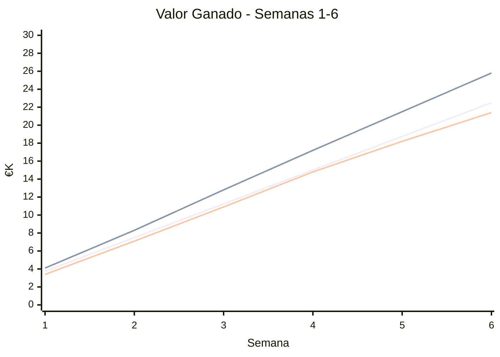

# 📊 Informe Semanal - [Biblioteca Digital v1.0]
*Semana [X] | Sprint [Y] | Actualizado: [02/06/2026]*

---

## 🚦 Resumen Ejecutivo
| Indicador | Estado | Mensaje Clave |
|-----------|--------|--------------|
| **📅 Cronograma** | [🟢] | [Estamos cumpliendo los plazos] |
| **💰 Presupuesto** | [🟡] | [Dentro de los margenes, algo por encima] |
| **🎯 Alcance** | [🟢] | [Peticion formal busqueda por "Genero" implementada] |
| **🧪 Calidad** | [🟢] | [Test cumbren el 86%] |

**Estado General**: [🟢] **[Avanza correctamente]**

---

## 📈 Curva S

🔍 Lectura rápida: [2-3 frases máx.]

📉 Tendencias
Métrica
Tendencia
Interpretación
Acción
CPI
[📈/📉/〰️]
[1 frase]
[1 acción]
SPI
[📈/📉/〰️]
[1 frase]
[1 acción]

✅ Acciones para Próxima Semana
[Acción 1] (@owner)
[Acción 2] (@owner)
🔗 [Enlaces relevantes]
ℹ️ Próximo informe: [fecha]. Para preguntas, abrir issue con etiqueta status-question.

