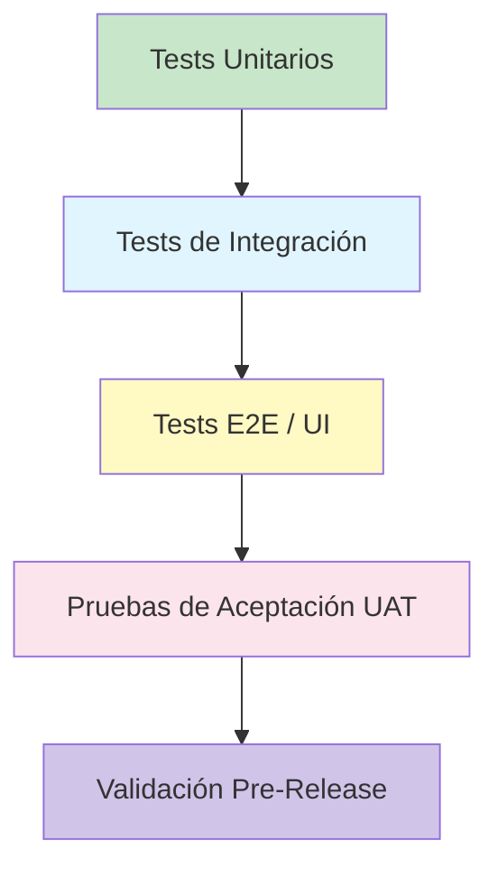

# 🔍 QC Strategy (Quality Control)
## 🎯 Propósito
Definir cómo detectamos, validamos y corregimos defectos en el producto entregado. QC se enfoca en el **QUÉ** construimos y garantiza que cumple los requisitos antes de llegar al usuario.

> 📌 **Alcance:** Aplica a todas las entregas de `Biblioteca Digital v1.0`.

---

## 📐 1. Pirámide de Testing y Flujo de Ejecución

| Nivel | Qué Valida | Cuándo se Ejecuta | Responsable | Automatización |
|---|---|---|---|---|
| Unitarios | Lógica aislada de funciones/clases | Local + CI en cada push | Desarrollador | ✅ Jest / Vitest |
| Integración | Comunicación entre módulos/API/BD | CI en PR → develop | QA + Devs | ✅ Supertest / Playwright API |
| E2E / UI | Flujo completo desde usuario final | Nightly o pre-release | QA | ✅ Cypress / Playwright |
| UAT | Cumplimiento de criterios de negocio | Antes de release a producción | Usuario clave + PM | ❌ Manual (guiado por checklist) |
| Pre-Release | Estabilidad, rendimiento, seguridad | 24-48h antes de deploy | QA + DevOps | ✅ Scripts + monitors |

