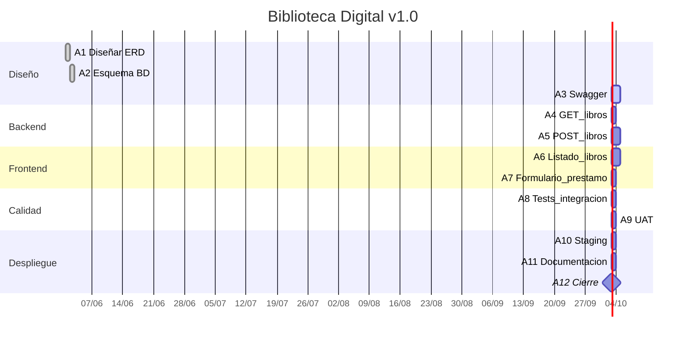

🔥 Claves para que NO vuelva a fallar
✔️ SOLO after una_tarea
❌ NO after a1 a2
✔️ milestone siempre con after
✔️ nada de espacios raros en la sintaxis

Leyenda de estados:
✅ :done = Completado
🔵 :active = En progreso
⚪ : = Pendiente
