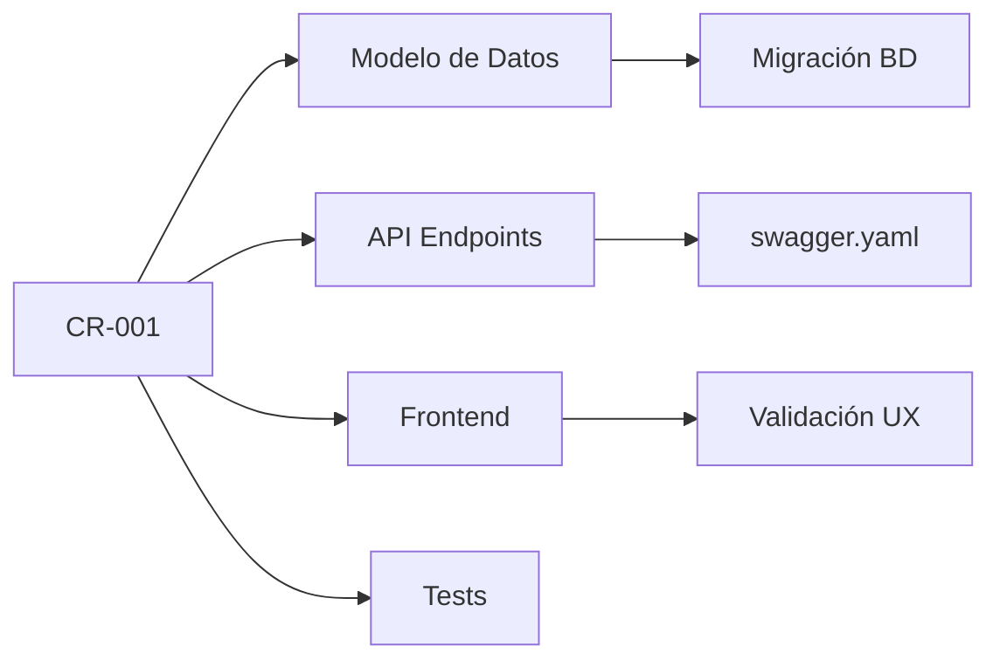
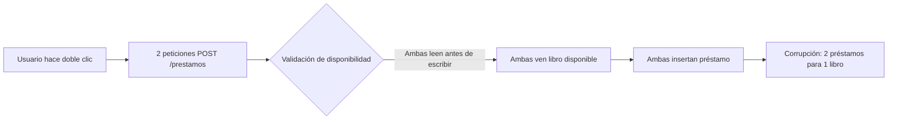

name: 🔄 Solicitud de Cambio (Change Request)
about: Proponer una modificación formal al alcance aprobado
title: "[CR-XXX] Breve descripción del cambio"
labels: change-request, needs-analysis
assignees: carlos-ruiz-pm
projects: biblioteca-documentacion/1
---

## 📋 Descripción del Cambio
¿Qué se propone añadir, modificar o eliminar?

> Ejemplo: "Añadir campo opcional 'categoría' (enum: ['novela', 'ensayo', 'infantil', 'académico', 'otros']) al modelo Libro y endpoints relacionados."

## 🎯 Justificación de Negocio
¿Por qué es necesario este cambio? ¿Qué problema resuelve o qué oportunidad aprovecha?

> Ejemplo: "Según feedback de 5 bibliotecarios (ver adjunto), la capacidad de filtrar libros por categoría reduciría el tiempo de búsqueda en un 30%. Esto mejora la experiencia del usuario y la eficiencia operativa."

## 👤 Solicitante y Fecha
- **Solicitante:** Ana Gómez (Bibliotecaria Jefe)
- **Fecha:** 15 de junio de 2026
- **Prioridad percibida:** 🟡 Media

## 🔗 Impacto Preliminar (a completar por el solicitante)
| Área | Impacto Estimado | Comentarios |
|------|-----------------|-------------|
| Alcance | 🟡 Medio | Afecta a módulo Libros y búsqueda |
| Tiempo | ? | Por estimar por equipo técnico |
| Coste | ? | Por estimar por equipo técnico |
| Riesgo | 🟢 Bajo | Cambio aislado, sin dependencias externas |

## 📎 Adjuntos (opcional pero recomendado)
- [ ] Wireframe/prototipo (enlace a Draw.io)
- [ ] Feedback de usuarios (screenshots, transcripciones)
- [ ] Análisis competitivo o benchmark

---

> ⚠️ **Nota para solicitantes:**  
> - Los cambios no urgentes se revisan en el próximo Sprint Planning.  
> - Los cambios urgentes (bloqueantes) se escalan directamente al Sponsor.  
> - **Sin aprobación formal del CCB, el cambio NO se implementará.**

## 🔍 Análisis de Impacto - CR-001: Campo 'categoría' en Libro

### 📊 Resumen Ejecutivo
| Área | Impacto Estimado | Justificación |
|------|-----------------|--------------|
| **Alcance** | 🟡 Medio | Afecta a módulo Libros (backend + frontend) y búsqueda |
| **Tiempo** | +2.1 días laborables | 17 horas estimadas (desglose abajo) |
| **Coste** | +€850 | 17h × €50/h (coste horario interno) |
| **Riesgo** | 🟢 Bajo | Cambio aislado, sin dependencias externas críticas |
| **Calidad** | 🟢 Mejora | Permite tests más específicos por categoría |

### 🧱 Desglose de Tareas y Estimación
| Tarea | Owner | Estimación (h) | Dependencias |
|-------|-------|---------------|-------------|
| Migración BD: añadir columna 'categoria' | @maria | 2h | - |
| Actualizar swagger.yaml (schema + ejemplos) | @maria | 1h | - |
| Backend: validar y persistir campo | @maria | 3h | swagger.yaml |
| Frontend: dropdown en formulario registro | @carlos | 4h | Backend listo |
| Frontend: filtro por categoría en listado | @carlos | 3h | Backend listo |
| Tests: unitarios + integración nuevo campo | @ana | 3h | Código implementado |
| Documentación: actualizar README y guías | @carlos | 1h | - |
| **TOTAL** | | **17h** | |

### 🔗 Dependencias y Efectos en Cascada



### 🧭 Composición Recomendada del CCB en Software

| Rol | Representante Típico | Función en el CCB |
|-----|---------------------|-----------------|
| **👤 Sponsor / Patrocinador** | Director de TI, Product Owner | ✅ Voto decisivo: aprueba/rechaza basándose en ROI y estrategia |
| **💻 Representante Técnico** | Tech Lead, Arquitecto | ✅ Evalúa viabilidad técnica, deuda técnica, impacto en arquitectura |
| **👥 Representante de Usuarios** | Usuario clave, Business Analyst | ✅ Valida que el cambio aporta valor real al usuario final |
| **📊 Project Manager** | PM del proyecto | ✅ Presenta análisis de impacto, recomienda, ejecuta la decisión |
| **🔐 Legal/Compliance** (si aplica) | Auditor, Responsable GDPR | ✅ Veto si el cambio incumple normativas |

> 💡 **Nota:** En proyectos pequeños, el CCB puede ser solo Sponsor + PM + Tech Lead. Lo importante es que haya **múltiples perspectivas** antes de decidir.

## ✍️ Acta de Decisión CCB - CR-001

### 📋 Información de la Reunión
| Campo | Valor |
|-------|-------|
| **ID del Cambio** | CR-001: Campo 'categoría' en Libro |
| **Fecha de Revisión** | 17 de junio de 2026 |
| **Participantes CCB** | María López (Sponsor), Carlos Ruiz (PM), María Dev (Tech Lead), Ana Gómez (Usuario) |
| **Quórum** | ✅ Completo (4/4) |

### 🔍 Resumen del Análisis de Impacto
- **Tiempo adicional:** +2.1 días laborables
- **Coste adicional:** +€850
- **Riesgo técnico:** 🟢 Bajo
- **Valor para usuario:** 30% menos tiempo de búsqueda (feedback validado)

### 💬 Discusión Clave
| Participante | Comentario |
|-------------|-----------|
| **Ana (Usuario)** | "Este cambio es crítico para nuestro día a día. Lo hemos solicitado 3 veces en pruebas de usabilidad." |
| **María Dev (Tech)** | "Técnicamente limpio. Podemos implementarlo sin afectar otros módulos. Tests adicionales cubrirán el nuevo campo." |
| **Carlos (PM)** | "El impacto cabe en el buffer de contingencia. Recomiendo aprobar para mantener confianza con el usuario." |
| **María López (Sponsor)** | "El ROI es claro: €850 ahora vs. €18K/año de ahorro. Aprobado." |

### ✅ Decisión Final
| Voto | Resultado |
|------|----------|
| **Aprobar** | ✅ 4 votos |
| **Rechazar** | ❌ 0 votos |
| **Abstenerse** | ⚪ 0 votos |

**Decisión:** ✅ **APROBADO** - Implementar cambio completo (Opción A)

### 📋 Condiciones de Aprobación
1. [ ] Actualizar línea base del cronograma: H2 se desplaza a 24/06 (+2 días)
2. [ ] Actualizar presupuesto: añadir €850 a partida de desarrollo
3. [ ] Comunicar decisión al equipo en Daily del 18/06
4. [ ] Crear Issues técnicos vinculados a CR-001 para trazabilidad
5. [ ] Incluir validación de usabilidad del nuevo campo en Sprint Review

### 📝 Registro de Lecciones
> *"Los cambios solicitados por usuarios clave con feedback cuantificado tienen alta probabilidad de aprobación. Documentar el 'por qué' es tan importante como el 'qué'."*

### ✍️ Firmas
| Rol | Nombre | Firma | Fecha |
|-----|--------|-------|-------|
| Sponsor | María López | __________________ | 17/06/2026 |
| PM | Carlos Ruiz | __________________ | 17/06/2026 |
| Tech Lead | María Dev | __________________ | 17/06/2026 |
| Usuario | Ana Gómez | __________________ | 17/06/2026 |

# 🛠️ Acción Correctiva - AC-001: Retraso Módulo Préstamos

## 📋 Información Básica
| Campo | Valor |
|-------|-------|
| **ID** | AC-001 |
| **Fecha Detección** | 20/06/2026 |
| **Desvío Detectado** | SPI = 0.82, endpoint POST /prestamos retrasado 2 días |
| **Impacto en Hito** | H3 (MVP staging) en riesgo de retraso +3 días |

## 🔍 Análisis de Causa Raíz (5 Porqués)
1. ¿Por qué se retrasó POST /prestamos? → Validación ISBN falla intermitentemente
2. ¿Por qué falla? → API externa tiene timeout de 30s sin retry
3. ¿Por qué no se detectó antes? → Pruebas de integración se hicieron en local con mock
4. ¿Por qué no había fallback? → No se consideró en diseño inicial
5. ¿Por qué? → Falta de análisis de riesgos para dependencias externas ✅ **Causa raíz**

## ✅ Acciones Definidas
| Acción | Owner | Fecha Límite | Criterio de Éxito | Estado |
|--------|-------|-------------|------------------|--------|
| Implementar mock para desarrollo frontend | @carlos | 24/06 | Frontend integra sin bloqueos | 🔄 En progreso |
| Añadir timeout + retry + fallback regex | @maria | 26/06 | API responde <2s en 95% de casos | ⚪ Pendiente |
| Actualizar estimaciones con buffer 20% | @pm | 24/06 | Nuevas fechas aprobadas por Sponsor | ✅ Completado |

## 📊 Monitoreo
| Fecha | SPI | CPI | Notas |
|-------|-----|-----|-------|
| 20/06 (detección) | 0.82 | 0.91 | Inicio acción correctiva |
| 27/06 (seguimiento) | 0.88 | 0.93 | Mejora visible, continuar |
| 04/07 (cierre) | 0.94 | 0.96 | ✅ Recuperado, cerrar AC-001 |

## 📝 Lección Aprendida
> *"Las dependencias externas requieren adapter layer + fallback desde el diseño, no como parche posterior."*

🔗 Relacionado: [Issue #45 - Validación ISBN inestable](https://github.com/.../issues/45)

# 🛡️ Acción Preventiva - AP-002: Mitigar Riesgo de Rotación en Auth

## 📋 Información Básica
| Campo | Valor |
|-------|-------|
| **ID** | AP-002 |
| **Fecha Identificación** | 18/06/2026 |
| **Riesgo** | Solo 1 persona conoce módulo de autenticación (bus factor = 1) |
| **Probabilidad/Impacto** | Media / Alto → 🔴 Prioridad Alta |

## 🎯 Objetivo de la Prevención
Reducir el "bus factor" del módulo de autenticación de 1 a ≥3 personas en 4 semanas, para garantizar continuidad ante rotación de personal.

## ✅ Acciones Definidas
| Acción | Owner | Fecha Límite | Métrica de Verificación | Estado |
|--------|-------|-------------|------------------------|--------|
| Documentar arquitectura y flujos de auth | @maria | 25/06 | Documento revisado y aprobado por tech lead | ✅ Completado |
| Pair programming rotativo en tareas de auth | @pm | Semanal | 2 personas adicionales pueden modificar auth sin ayuda | 🔄 En progreso |
| Crear runbook de troubleshooting | @maria | 30/06 | Soporte resuelve 3 escenarios comunes sin escalar | ⚪ Pendiente |

## 🔍 Indicadores Tempranos de Alerta
| Indicador | Umbral 🟡 | Umbral 🔴 | Fuente de Datos |
|-----------|----------|----------|----------------|
| Personas con conocimiento profundo de auth | < 2 | = 1 | Registro de pair programming |
| Tiempo para onboarding en módulo auth | > 3 días | > 5 días | Feedback de nuevos devs |
| Incidencias de auth que requieren escalar a @maria | > 2/semana | > 5/semana | Tickets de soporte |

## 📊 Monitoreo Mensual
| Fecha | Bus Factor | Onboarding Time | Escalados a @maria | Estado |
|-------|-----------|----------------|-------------------|--------|
| 18/06 (inicio) | 1 | 5 días | 4/semana | 🔴 En riesgo |
| 02/07 (seguimiento) | 2 | 3 días | 2/semana | 🟡 Mejorando |
| 16/07 (cierre) | 3 | 2 días | 0/semana | ✅ Mitigado |

## 📝 Lección Aprendida
> *"La documentación técnica no es un 'extra': es un seguro de continuidad. Invertir 4h en documentar ahorra 40h en firefighting futuro."*


# 🔧 Reparación de Defecto - BUG-003: Préstamo Duplicado por Condición de Carrera

## 📋 Información Básica
| Campo | Valor |
|-------|-------|
| **ID** | BUG-003 |
| **Fecha Reporte** | 22/06/2026 14:30 |
| **Reportado por** | Ana Gómez (Usuario) vía email |
| **Severidad** | 🔴 Crítica (corrupción de datos) |
| **Prioridad** | 🔴 Inmediata (SLA: 24h) |

## 🐛 Descripción del Defecto
**Síntoma:** Un usuario puede registrar 2 préstamos para el mismo libro ISBN si hace clic 2 veces rápido en "Confirmar".

**Pasos para reproducir:**
1. Buscar libro disponible
2. Clic en "Solicitar Préstamo"
3. Hacer doble clic rápido en "Confirmar"
4. Resultado: 2 registros de préstamo para el mismo ISBN

**Impacto:** 
- 3 usuarios afectados (datos inconsistentes en BD)
- Posible sobre-préstamo de ejemplares físicos

## 🔍 Análisis de Causa Raíz


### Estructura Recomendada para Gestión de Crisis
biblioteca-documentacion/ 
├── README.md ← Estado actual + enlace a registro de crisis 
│ 
├── docs/ 
│ ├── crisis/ 
│ │ ├── ACCIONES-CORRECTIVAS/ ← AC-XXX: Para recuperar desvíos 
│ │ │ ├── plantilla-ac.md 
│ │ │ ├── AC-001-retraso-prestamos.md 
│ │ │ └── AC-002-sobrecoste.md
 │ │ │ 
│ │ ├── ACCIONES-PREVENTIVAS/ ← AP-XXX: Para mitigar riesgos 
│ │ │ ├── plantilla-ap.md 
│ │ │ ├── AP-001-tests-cobertura.md 
│ │ │ └── AP-002-bus-factor-auth.md 
│ │ │ 
│ │ ├── DEFECTOS/ ← BUG-XXX: Reparación de errores 
│ │ │ ├── plantilla-bug.md 
│ │ │ ├── BUG-001-prestamo-duplicado.md 
│ │ │ └── BUG-002-usabilidad-flujo.md 
│ │ │ 
│ │ └── PROCESO-CRISIS.md ← Guía: cuándo y cómo activar gestión de crisis 
│ │ 
│ ├── metrics/ 
│ │ ├── dashboard-crisis.md ← SPI, CPI, bugs críticos en tiempo real 
│ │ └── umbrales-alerta.md ← Definición de 🟡 y 🔴 para cada indicador 
│ │ │ └── retro/ 
│ └── post-mortem/ ← Análisis después de cada crisis 
│ └── plantilla-postmortem.md 
│ 
├── .github/ 
│ ├── ISSUE_TEMPLATE/ 
│ │ ├── corrective-action.md ← Plantilla para AC 
│ │ ├── preventive-action.md ← Plantilla para AP 
│ │ └── bug-report.md ← Plantilla para BUG 
│ │ 
│ └── workflows/ 
│ └── alert-crisis.yml ← Notificar al PM si SPI/CPI caen bajo umbral 
│ 
└── projects/ 
└── biblioteca-kanban ← Columna especial: "🚨 Crisis / Bloqueos"

## 📊 Análisis de Coste-Beneficio - Biblioteca Digital MVP

### 💰 Costes Estimados (12 semanas)

| Concepto | Cálculo | Importe |
|----------|---------|---------|
| Desarrollo (equipo interno) | 480h × €50/h | €24.000 |
| Herramientas (GitHub Pro, AWS Free Tier → Basic) | Licencias anuales prorrateadas | €2.500 |
| Formación del equipo en Swagger/CI-CD | 2 días × 4 personas × €200/día | €1.600 |
| Pruebas de usabilidad con usuarios reales | 3 sesiones × €300/sesión | €900 |
| Buffer de contingencia (15%) | 15% del subtotal | €4.350 |
| **TOTAL COSTES** | | **€33.350** |

### 📈 Beneficios Estimados (Anual, post-lanzamiento)

| Beneficio | Cálculo | Valor Anual |
|-----------|---------|------------|
| Ahorro en tiempo administrativo | 12h/semana × 52 semanas × €25/h | €15.600 |
| Reducción de errores en registro de préstamos | 3 errores/semana × 52 × €50/error (reclamaciones) | €7.800 |
| Incremento en préstamos por accesibilidad 24/7 | +15% préstamos × €2 margen promedio × 5.000 préstamos/año | €15.000 |
| Mejora en satisfacción de usuarios (NPS +2) | Estimación de retención + reducción de quejas | €3.000 (conservador) |
| **TOTAL BENEFICIOS ANUALES** | | **€41.400** |

### 📊 Resumen Coste-Beneficio
| Métrica | Valor | Interpretación |
|---------|-------|---------------|
| **Inversión total** | €33.350 | Coste único para desarrollar MVP |
| **Beneficio anual recurrente** | €41.400 | Ahorro + ingresos adicionales por año |
| **Payback (Recuperación)** | €33.350 ÷ €41.400 ≈ **0.8 años** (~10 meses) | Tiempo para recuperar la inversión |
| **Beneficio neto a 3 años** | (€41.400 × 3) - €33.350 = **€90.850** | Valor generado tras recuperar costes | 

## 💰 Cálculo de ROI - Biblioteca Digital MVP

### Datos de Entrada
| Parámetro | Valor |
|-----------|-------|
| Coste inicial del proyecto | €33.350 |
| Beneficio anual estimado | €41.400 |
| Vida útil esperada del software | 3 años (antes de requerir refactorización mayor) |
| Coste anual de mantenimiento estimado | €3.000 (hosting, soporte, pequeñas mejoras) |

### Cálculo Paso a Paso

1. **Beneficio Neto Anual**:
   Beneficio Bruto Anual - Coste Mantenimiento Anual
   €41.400 - €3.000 = **€38.400**

2. **Beneficio Neto Total (3 años)**:
   Beneficio Neto Anual × Vida Útil - Coste Inicial
   (€38.400 × 3) - €33.350 = €115.200 - €33.350 = **€81.850**

3. **ROI Total del Proyecto**:
   (Beneficio Neto Total ÷ Coste Inicial) × 100
   (€81.850 ÷ €33.350) × 100 = **245%**

4. **ROI Anual Promedio**:
   ROI Total ÷ Vida Útil
   245% ÷ 3 años = **82% anual**

### 📈 Visualización del Flujo de Caja 
Año 0 (Inversión): -€33.350 ████████████████████ 
Año 1 (Beneficio): +€38.400 ████████████████████████████ 
Año 2 (Beneficio): +€38.400 ████████████████████████████ 
Año 3 (Beneficio): +€38.400 ████████████████████████████ ─────────────────────────────────────────────────────
 Neto acumulado: +€81.850 ✅ ROI positivo desde mes 10
---
### 🔍 Análisis de Sensibilidad (¿Y si...?)
| Escenario | Supuesto | ROI Resultante | Decisión |
|-----------|----------|---------------|----------|
| **Optimista** | +25% en adopción de usuarios | 310% | ✅ Aprobar con entusiasmo |
| **Base** | Supuestos actuales | 245% | ✅ Aprobar |
| **Pesimista** | -30% en beneficios, +20% en costes | 98% | 🟡 Aprobar con monitoreo estrecho |
| **Crítico** | -50% en beneficios, fallo técnico mayor | -15% | 🔴 Replantear o cancelar | 

## ⚠️ Riesgos de No Desarrollar Biblioteca Digital v1.0

### Matriz de Impacto/Probabilidad

| Riesgo | Probabilidad (1-5) | Impacto Anual Estimado (€) | Puntuación (P×I) | Mitigación si NO actuamos |
|--------|-------------------|---------------------------|-----------------|--------------------------|
| **Pérdida de eficiencia operativa** | 5 (Certeza) | €15.600 (tiempo administrativo) | 25 | Contratar personal adicional (+€20K/año) |
| **Abandono de usuarios por falta de acceso online** | 4 (Alta) | €15.000 (préstamos no realizados) | 20 | Campañas de marketing para compensar (-€5K/año, efectividad limitada) |
| **Errores manuales en registro de préstamos** | 4 (Alta) | €7.800 (reclamaciones + correcciones) | 16 | Doble verificación manual (+3h/semana = +€3.900/año) |
| **Incumplimiento futuro de normativa digital** | 3 (Media) | €25.000 (multa estimada + adaptación urgente) | 9 | Adaptación reactiva cuando sea obligatorio (coste ×3 por urgencia) |
| **Pérdida de relevancia frente a competencia digital** | 3 (Media) | Difícil de cuantificar, pero impacto estratégico alto | 15 | Inversión mayor posterior para "ponerse al día" |

### 💰 Coste Estimado de la Inacción (Anual)
Coste Directo de Ineficiencias: €15.600 + €7.800 = €23.400 Coste de Oportunidad (préstamos perdidos): €15.000 Coste de Mitigación Parcial (doble verificación + marketing): €8.900 

# 💼 BUSINESS CASE - Biblioteca Digital MVP v1.0
*Documento de Justificación de Inversión*

---

## 📋 Resumen Ejecutivo

| Campo | Valor |
|-------|-------|
| **Proyecto** | Sistema de Gestión Bibliotecaria Digital - MVP |
| **Solicitante** | Ana Gómez, Bibliotecaria Jefe |
| **Sponsor** | María López, Directora de Tecnologías |
| **Fecha de Elaboración** | 1 de mayo de 2026 |
| **Inversión Solicitada** | €33.350 |
| **ROI Estimado (3 años)** | 245% (82% anual) |
| **Payback** | ~10 meses |
| **Recomendación** | ✅ APROBAR - Alto retorno, riesgo controlado |

---

## 🎯 Problema u Oportunidad

### Situación Actual
- Registro manual de préstamos genera 3-5 errores/semana
- Usuarios no pueden reservar libros fuera de horario de biblioteca
- Personal dedica 12h/semana a tareas administrativas repetitivas

### Impacto Cuantificado
| Métrica | Valor Actual | Impacto Anual Estimado |
|---------|-------------|----------------------|
| Tiempo administrativo perdido | 12h/semana | €15.600 |
| Errores en registro | 3-5/semana | €7.800 |
| Préstamos no realizados por falta de acceso online | 34% de usuarios | €15.000 |
| **Total impacto negativo** | | **€38.400/año** |

---

## 💰 Análisis de Coste-Beneficio

### Costes del Proyecto (Únicos)
| Concepto | Importe |
|----------|---------|
| Desarrollo (480h × €50/h) | €24.000 |
| Herramientas y licencias | €2.500 |
| Formación del equipo | €1.600 |
| Pruebas de usabilidad | €900 |
| Buffer de contingencia (15%) | €4.350 |
| **TOTAL COSTES** | **€33.350** |

### Beneficios Esperados (Anuales, Recurrentes)
| Beneficio | Valor Anual |
|-----------|------------|
| Ahorro en tiempo administrativo | €15.600 |
| Reducción de errores y reclamaciones | €7.800 |
| Incremento en préstamos por accesibilidad 24/7 | €15.000 |
| Mejora en satisfacción y retención de usuarios | €3.000 |
| **TOTAL BENEFICIOS** | **€41.400** |

### Métricas Financieras Clave
| Métrica | Cálculo | Resultado |
|---------|---------|-----------|
| **Payback** | €33.350 ÷ €41.400 | **~10 meses** |
| **ROI Total (3 años)** | [(€41.400×3 - €33.350) ÷ €33.350] × 100 | **245%** |
| **ROI Anual Promedio** | 245% ÷ 3 | **82%** |
| **Valor Presente Neto (VPN)* | €81.850 (descontando 5% anual) | **€74.200** |

*\*Cálculo simplificado; para aprobación formal, usar tasa de descuento corporativa*

---

## ⚠️ Riesgos de No Hacer Nada

| Riesgo | Prob. | Impacto Anual (€) | Mitigación sin Proyecto | Coste Mitigación |
|--------|-------|-----------------|------------------------|-----------------|
| Ineficiencia operativa | 5 | €15.600 | Contratar personal adicional | +€20.000/año |
| Abandono de usuarios | 4 | €15.000 | Campañas de marketing | +€5.000/año |
| Errores manuales | 4 | €7.800 | Doble verificación manual | +€3.900/año |
| Incumplimiento normativo futuro | 3 | €25.000 (multa) | Adaptación reactiva urgente | ×3 coste normal |
| Pérdida de relevancia competitiva | 3 | Estratégico (difícil de cuantificar) | Inversión mayor posterior | Alto |

**Coste Total Anual de la Inacción: €47.300+**

> ✅ **Conclusión:** Invertir €33.350 ahora evita gastar €47.300 cada año manteniendo el statu quo.

---

## 🔄 Alternativas Evaluadas

| Opción | Coste | Beneficio Anual | ROI | Riesgos | Recomendación |
|--------|-------|----------------|-----|---------|--------------|
| **🥇 Desarrollar MVP web responsive** | €33.350 | €41.400 | 245% | 🟢 Bajo (scope acotado) | ✅ **Recomendada** |
| 🥈 Comprar software comercial | €60.000 + €12.000/año | €35.000 | 45% | 🟡 Medio (dependencia de proveedor) | Alternativa si hay urgencia extrema |
| 🥉 Posponer 12 meses | €0 ahora | €0 ahora | N/A | 🔴 Alto (pérdida de usuarios, deuda técnica) | No recomendada |
| ❌ No hacer nada | €0 | -€47.300 (coste de inacción) | Negativo | 🔴 Crítico | Rechazar |

---

## 🎯 Criterios de Éxito y Métricas de Seguimiento

| Objetivo | Métrica | Target | Frecuencia de Medición |
|----------|---------|--------|----------------------|
| Reducir tiempo administrativo | Horas/semana en registro de préstamos | 12h → 3h | Mensual |
| Mejorar experiencia de usuario | NPS de usuarios que reservan online | ≥ 7 | Trimestral |
| Incrementar préstamos | Nº de préstamos realizados online | +15% vs baseline | Mensual |
| Controlar costes de mantenimiento | Coste anual post-lanzamiento | ≤ €3.000 | Anual |

---

## ⚠️ Riesgos del Proyecto y Mitigación

| Riesgo | Prob. | Impacto | Mitigación | Owner |
|--------|-------|---------|-----------|-------|
| Dependencia de API externa de ISBN | Media | Medio | Adapter layer + fallback a regex | @maria |
| Cambios de alcance no gestionados | Alta | Alto | Proceso formal de cambios + buffer 15% | @pm |
| Rotación de desarrollador clave | Baja | Alto | Documentación continua + pair programming | @pm |
| Baja adopción por usuarios | Media | Alto | Pruebas de usabilidad tempranas + iteración | @ana |

---

## ✍️ Recomendación y Próximos Pasos

### Recomendación del Analista
> *"Se recomienda APROBAR el desarrollo del MVP de Biblioteca Digital. El ROI de 245% a 3 años, combinado con el alto coste de la inacción (€47.300/año), justifica claramente la inversión de €33.350. Los riesgos son identificables y mitigables con las medidas propuestas."*

### Próximos Pasos si se Aprueba
1. [ ] Firmar Project Charter y asignar equipo (Semana 1)
2. [ ] Iniciar fase de descubrimiento detallado y prototipado (Semanas 2-3)
3. [ ] Comenzar desarrollo en sprints de 2 semanas con revisiones quincenales
4. [ ] Medir métricas de éxito mensualmente post-lanzamiento
5. [ ] Evaluar expansión a Fase 2 (app móvil) tras validar adopción del MVP

---

## ✍️ Aprobaciones

| Rol | Nombre | Firma | Fecha | Decisión |
|-----|--------|-------|-------|----------|
| **Sponsor / Patrocinador** | María López | __________________ | ___/___/2026 | ✅ Aprobar / ❌ Rechazar |
| **Director Financiero** | __________________ | __________________ | ___/___/2026 | ✅ Aprobar / ❌ Rechazar |
| **Director de Operaciones** | __________________ | __________________ | ___/___/2026 | ✅ Aprobar / ❌ Rechazar |
| **Project Manager** | Carlos Ruiz | __________________ | ___/___/2026 | ✅ Visto bueno |

---
📎 **Anexos:**
- [ ] Anexo A: Detalle de estimación de esfuerzo por tarea
- [ ] Anexo B: Resultados de encuesta a usuarios (validación de demanda)
- [ ] Anexo C: Benchmark de soluciones similares en el mercado
- [ ] Anexo D: Cronograma detallado de hitos y entregables

## 🎯 Cuestionario de Selección de Estrategia

### Preguntas Clave (Puntuar 1-5 cada una)

| Pregunta | 1 (Bajo) → 5 (Alto) | Puntuación |
|----------|-------------------|-----------|
| ¿Qué tan únicos/diferenciadores son los requisitos? | 1=Estándar del sector, 5=Totalmente personalizados | ⭐⭐⭐⭐ |
| ¿Qué urgencia hay en lanzar la solución? | 1=Flexible (6+ meses), 5=Inmediato (<1 mes) | ⭐⭐ |
| ¿Qué presupuesto inicial está disponible? | 1=Bajo (<€10K), 5=Alto (>€50K) | ⭐⭐⭐ |
| ¿Qué capacidad técnica interna existe? | 1=Nula, 5=Equipo senior disponible | ⭐⭐⭐⭐ |
| ¿Qué importancia tiene el control total de datos? | 1=No crítico, 5=Regulado/estratégico | ⭐⭐⭐⭐⭐ |
| ¿Qué tolerancia al riesgo técnico hay? | 1=Baja (prefiero solución probada), 5=Alta (acepto innovación) | ⭐⭐⭐ |

### Interpretación de Resultados

🔹 **Mayoría de 4-5 en "Requisitos únicos" + "Control de datos"** → 🛠️ Desarrollo a Medida  
🔹 **Mayoría de 4-5 en "Urgencia" + "Bajo presupuesto"** → ☁️ SaaS  
🔹 **Puntuaciones equilibradas (2-4)** → 📦 COTS como punto medio  
🔹 **Alta incertidumbre en requisitos** → ☁️ SaaS para validar + migrar después  

### Ejemplo Biblioteca Digital: Puntuación Aplicada

| Pregunta | Puntuación | Justificación |
|----------|-----------|--------------|
| Requisitos únicos | 4 | Validación ISBN personalizada + integración legacy |
| Urgencia | 2 | MVP en 3 meses es aceptable |
| Presupuesto | 3 | €35K disponible, pero no ilimitado |
| Capacidad técnica | 4 | Equipo interno con experiencia en Node/React |
| Control de datos | 5 | GDPR + datos de usuarios sensibles |
| Tolerancia al riesgo | 3 | Preferimos mitigar riesgos técnicos conocidos |

✅ **Recomendación**: Desarrollo a Medida con MVP acotado, validando hipótesis clave antes de escalar.

## ✅ Viabilidad Técnica - Biblioteca Digital v1.0

### Stack Tecnológico Propuesto
| Componente | Tecnología Propuesta | ¿Experiencia Interna? | ¿Alternativa si no? |
|-----------|---------------------|---------------------|-------------------|
| Backend | Node.js + Express | ✅ Sí (2 devs con experiencia) | Python/Django (curva de aprendizaje 2 semanas) |
| Frontend | React + TypeScript | ✅ Sí (1 dev con experiencia) | Vue.js (similar, pero requiere formación) |
| Base de datos | PostgreSQL | ✅ Sí (conocimiento básico) | MySQL (más familiar, pero menos features) |
| Infraestructura | AWS (EC2 + RDS) | 🟡 Parcial (conocimiento teórico) | Render/Railway (más simple, pero menos flexible) |
| CI/CD | GitHub Actions | 🟡 Parcial (nunca usado en producción) | Scripts manuales + monitoreo básico |

### Riesgos Técnicos Identificados
| Riesgo | Probabilidad | Impacto | Mitigación |
|--------|-------------|---------|-----------|
| Integración con API externa de ISBN | Media | Medio | Adapter layer + fallback a regex + mock para desarrollo |
| Escalabilidad no prevista en arquitectura | Baja | Alto | Diseñar con microservicios desde el inicio (aunque se implemente como monolito) |
| Deuda técnica por presión de tiempo | Alta | Medio | Definition of Done estricta + sprint de refactorización cada 3 sprints |

### Brechas de Conocimiento y Plan de Cierre
| Brecha | Impacto en Proyecto | Acción de Cierre | Owner | Fecha Límite |
|--------|-------------------|-----------------|--------|-------------|
| GitHub Actions en producción | Riesgo de despliegues manuales error-prone | Tutorial interno + PoC en rama de prueba | @pedro | Semana 2 |
| Optimización de queries PostgreSQL | Posible lentitud con >10K registros | Sesión de pairing con DBA externo | @maria | Semana 4 |

### ✅ Veredicto Técnico
🟢 **VIABLE** - Con las mitigaciones y plan de cierre de brechas propuestos. 


## 💰 Análisis Económico Detallado

### Costes Totales Estimados (3 años)
| Concepto | Año 1 | Año 2 | Año 3 | Total |
|----------|-------|-------|-------|-------|
| Desarrollo inicial | €30.800 | - | - | €30.800 |
| Mantenimiento anual | €3.000 | €3.000 | €3.000 | €9.000 |
| Infraestructura (AWS) | €2.500 | €2.500 | €2.500 | €7.500 |
| Formación y onboarding | €1.600 | €500 | €500 | €2.600 |
| **TOTAL COSTES** | **€37.900** | **€6.000** | **€6.000** | **€49.900** |

### Beneficios Totales Estimados (3 años)
| Beneficio | Año 1* | Año 2 | Año 3 | Total |
|-----------|--------|-------|-------|-------|
| Ahorro administrativo | €7.800** | €15.600 | €15.600 | €39.000 |
| Reducción de errores | €3.900** | €7.800 | €7.800 | €19.500 |
| Préstamos incrementales | €7.500** | €15.000 | €15.000 | €37.500 |
| Mejora en satisfacción | €1.500** | €3.000 | €3.000 | €7.500 |
| **TOTAL BENEFICIOS** | **€20.700** | **€41.400** | **€41.400** | **€103.500** |

*\* Año 1: beneficios prorrateados (lanzamiento en mes 3)*

### Métricas Financieras Clave
| Métrica | Fórmula | Cálculo | Resultado |
|---------|---------|---------|-----------|
| **Beneficio Neto Total** | Beneficios - Costes | €103.500 - €49.900 | **€53.600** |
| **ROI Total (3 años)** | (Beneficio Neto ÷ Costes) × 100 | (€53.600 ÷ €49.900) × 100 | **107%** |
| **Payback** | Tiempo para recuperar inversión | €37.900 ÷ (€41.400/12) | **~11 meses** |
| **VPN (5% descuento)** | Flujo descontado al presente | Cálculo financiero | **€46.200** |

### Análisis de Sensibilidad (¿Y si...?)
| Escenario | Supuesto | ROI Resultante | Decisión |
|-----------|----------|---------------|----------|
| **Optimista** | +25% adopción, -10% costes | 145% | ✅ Aprobar con entusiasmo |
| **Base** | Supuestos actuales | 107% | ✅ Aprobar |
| **Pesimista** | -30% beneficios, +20% costes | 38% | 🟡 Aprobar con monitoreo estrecho |
| **Crítico** | -50% beneficios, fallo técnico mayor | -22% | 🔴 Replantear o cancelar |

### ✅ Veredicto Económico
🟢 **VIABLE** - ROI positivo incluso en escenario pesimista, payback < 12 meses.

## ✅ Viabilidad Operativa - Biblioteca Digital v1.0

### Alineación con Procesos Actuales
| Proceso Actual | Cambio Propuesto | Impacto Operativo | Mitigación |
|---------------|-----------------|-----------------|-----------|
| Registro manual de préstamos en papel | Formulario web + validación automática | 🟡 Medio: requiere formación inicial | Sesión de capacitación + guía rápida impresa |
| Búsqueda de disponibilidad en sistema legacy | Búsqueda unificada en nueva interfaz | 🟢 Bajo: mejora evidente para usuarios | Demostración en vivo + soporte durante transición |
| Reportes mensuales manuales en Excel | Dashboard automático exportable | 🟢 Bajo: ahorro de tiempo inmediato | Migración asistida de plantillas existentes |

### Perfil y Preparación de Usuarios Finales
| Grupo de Usuarios | Nº Estimado | Nivel Técnico | Necesidades de Formación |
|------------------|-------------|--------------|-------------------------|
| Bibliotecarios (uso diario) | 5 | 🟡 Medio (ofimática) | 2 horas de capacitación práctica + cheat sheet |
| Usuarios finales (reservas online) | ~500/mes | 🟢 Variable | Interfaz intuitiva + tooltips + soporte por email |
| Personal de soporte IT | 2 | 🔴 Alto | Documentación técnica + acceso a logs + runbook |

### Factores de Adopción y Resistencia al Cambio
| Factor | Evaluación | Estrategia de Gestión |
|--------|-----------|---------------------|
| **🎯 Valor percibido por usuarios** | Alto (ahorra tiempo, reduce errores) | Comunicar beneficios tempranos + celebrar "quick wins" |
| **🔄 Complejidad del cambio** | Medio (nueva interfaz, pero flujos similares) | Mantener terminología familiar + permitir modo "clásico" temporal |
| **👥 Sponsorship interno** | Alto (Bibliotecaria Jefe es champion) | Involucrarla en demos, testing y comunicación interna |
| **⚙️ Integración con herramientas existentes** | Medio (conexión con sistema legacy) | Adapter layer transparente + fallback manual si falla |

### Métricas de Éxito Operativo
| Métrica | Baseline Actual | Target Post-Implementación | Frecuencia de Medición |
|---------|---------------|---------------------------|----------------------|
| Tiempo medio para registrar préstamo | 8 minutos | < 3 minutos | Semanal (primeros 3 meses) |
| Errores en registro de préstamos | 3-5/semana | < 1/semana | Mensual |
| Satisfacción de bibliotecarios (encuesta interna) | 6.2/10 | ≥ 8.5/10 | Trimestral |
| Adopción de reservas online por usuarios | 0% | ≥ 40% en 6 meses | Mensual |

### ✅ Veredicto Operativo
🟢 **VIABLE** - Con plan de formación, comunicación proactiva y métricas de seguimiento. 

# 🚦 Veredicto de Viabilidad - Biblioteca Digital v1.0

## Resumen por Dimensión
| Dimensión | Veredicto | Condición Clave |
|-----------|----------|----------------|
| 🔧 Técnica | 🟢 VIABLE | Cerrar brechas en GitHub Actions y optimización DB en primeras 4 semanas |
| 💰 Económica | 🟢 VIABLE | ROI 107% a 3 años, payback ~11 meses, positivo incluso en escenario pesimista |
| 👥 Operativa | 🟢 VIABLE | Plan de formación + comunicación + métricas de adopción definidas |

## ✅ Decisión Recomendada
**APROBAR PROYECTO** - Con las siguientes condiciones:

1. 🎯 Alcance MVP acotado: validar hipótesis clave antes de escalar
2. 📊 Monitoreo mensual de métricas de éxito (técnico, económico, operativo)
3. 🔄 Revisión de viabilidad al finalizar Sprint 3: si alguna dimensión se degrada, reevaluar
4. 📋 Documentación de lecciones aprendidas para futuros proyectos

## 🚨 Condiciones de Cancelación (Trigger Points)
Si en cualquier momento se cumple UNA de estas condiciones, detener y reevaluar:
- 🔴 SPI < 0.70 por 2 sprints consecutivos (retraso crítico no recuperable)
- 🔴 CPI < 0.80 con forecast final > +30% sobre presupuesto
- 🔴 Adopción de usuarios < 15% a los 3 meses post-lanzamiento
- 🔴 Rotación de >1 miembro clave del equipo sin plan de handover

## 📅 Próximos Pasos si se Aprueba
1. [ ] Firmar Project Charter con alcance, cronograma y criterios de éxito (Semana 1)
2. [ ] Iniciar Sprint 0: configuración de entorno + PoC de integración ISBN (Semanas 2-3)
3. [ ] Comenzar desarrollo en sprints de 2 semanas con revisiones quincenales de viabilidad
4. [ ] Medir métricas de éxito mensualmente post-lanzamiento y ajustar roadmap 

## 📋 Descomposición de Actividades - Biblioteca Digital v1.0

### Paquete: 3.1.1 CRUD de Libros
| ID Actividad | Descripción (Verbo + Objeto) | Entregable Verificable | Criterio de Aceptación | Estimación Inicial |
|-------------|-----------------------------|----------------------|----------------------|-------------------|
| 3.1.1.1 | Diseñar esquema de tabla `libros` | Script SQL `001_create_books.sql` | ✅ Campos: isbn (PK), titulo, autor, disponible, categoria<br>✅ Índices en titulo y autor | 2h |
| 3.1.1.2 | Implementar endpoint GET /libros | Endpoint funcional + tests | ✅ Responde 200 con array de libros<br>✅ Soporta filtros ?autor= y ?disponible=<br>✅ Tiempo respuesta <500ms p95 | 4h |
| 3.1.1.3 | Implementar POST /libros con validación | Endpoint funcional + tests | ✅ Valida formato ISBN-13<br>✅ Rechaza campos obligatorios vacíos<br>✅ Retorna 201 con libro creado | 6h |
| 3.1.1.4 | Implementar PUT/DELETE /libros/:isbn | Endpoints funcionales + tests | ✅ PUT actualiza solo campos permitidos<br>✅ DELETE marca como no disponible (soft delete)<br>✅ Tests cubren casos de error | 5h |
| 3.1.1.5 | Escribir tests unitarios para CRUD | Suite de tests en `/tests/libros/` | ✅ Cobertura >80% en lógica de negocio<br>✅ Tests pasan en CI/CD | 4h |
| 3.1.1.6 | Documentar endpoints en swagger.yaml | swagger.yaml actualizado y válido | ✅ Sin errores en validación online<br>✅ Ejemplos de request/response incluidos | 2h |

### ✅ Reglas para Definir Actividades Efectivas
🔹 **Verbos accionables**: "Implementar", "Validar", "Documentar" (no "Trabajar en...", "Revisar...")
🔹 **Entregables tangibles**: Código, documento, configuración, test (no "progreso", "avance")
🔹 **Duración estimable**: 4-40 horas ideal; si >40h, descomponer más
🔹 **Asignable**: Una persona o par puede ejecutarla sin dependencias externas no gestionadas

# 🗓️ Cronograma Base - Biblioteca Digital v1.0

## 📊 Vista Resumen por Sprint

### Sprint 1: Fundamentos (01-14 jun 2026)
| Semana | Actividades Clave | Hitos | Owner Principal |
|--------|-----------------|-------|----------------|
| 1 | • Diseñar ERD<br>• Esquema BD<br>• Crear tabla libros | ✅ Modelo de datos aprobado | María |
| 2 | • GET /libros<br>• POST /libros + validación<br>• Documentar swagger<br>• Tests integración | ✅ API base funcional + documentada | María + Carlos |

### Sprint 2: Flujo de Préstamo (15-28 jun 2026)
| Semana | Actividades Clave | Hitos | Owner Principal |
|--------|-----------------|-------|----------------|
| 3 | • Autenticación bibliotecarios<br>• Lógica de disponibilidad<br>• Frontend: listado + búsqueda | ✅ Módulo Libros completo | María + Carlos |
| 4 | • Frontend: formulario préstamo<br>• Endpoint POST /prestamos<br>• Pruebas E2E | ✅ Flujo préstamo funcional en staging | Carlos + Ana |

### Sprint 3: Pulido + Lanzamiento (29 jun - 12 jul 2026)
| Semana | Actividades Clave | Hitos | Owner Principal |
|--------|-----------------|-------|----------------|
| 5 | • Mejoras UX (validaciones en tiempo real)<br>• Pruebas de usabilidad con 3 usuarios | ✅ Feedback de usuarios incorporado | Carlos + Ana |
| 6 | • Corrección de bugs críticos<br>• Despliegue en producción<br>• Documentación final | 🎯 MVP lanzado + aceptado | Equipo completo |

## 🔗 Dependencias Críticas (Camino Crítico)
```mermaid
graph LR
    A[ERD aprobado] --> B[Esquema BD]
    B --> C[Tabla libros]
    C --> D[GET /libros]
    D --> E[POST /libros]
    E --> F[swagger.yaml]
    F --> G[Tests integración]
    G --> H[UAT usuarios]
    H --> I[Despliegue producción]

biblioteca-documentacion/
├── docs/
│   ├── resources/
│   │   ├── matriz-asignacion.md      ← Tabla de owners, horas, % carga
│   │   ├── capacidad-real.md         ← Cálculo semanal con descuento de reuniones/buffer
│   │   ├── inventario-tecnico.md     ← Licencias, cloud, APIs, costes recurrentes
│   │   └── alertas-sobreasignacion.md ← Registro de desequilibrios y acciones correctivas
│   └── ...
├── .github/
│   └── ISSUE_TEMPLATE/
│       └── resource-request.md       ← Plantilla para solicitar nuevo recurso/herramienta
│
└── projects/
    └── biblioteca-kanban             ← Campo personalizado "Owner" + "Carga (%)"

# 👥 Matriz de Asignación de Recursos - Sprint [X]

## 📊 Capacidad del Equipo (Horas/Semana)
| Miembro | Rol | Horas Teóricas | - Reuniones | - Admin/Contexto | - Buffer | ✅ Capacidad Real |
|---------|-----|---------------|------------|-----------------|----------|-----------------|
| María | Backend | 40h | 6h | 4h | 4h | 26h |
| Carlos | Frontend | 40h | 6h | 4h | 4h | 26h |
| Ana | QA | 20h* | 3h | 2h | 2h | 13h |
| Pedro | DevOps | 10h* | 1.5h | 1h | 1h | 6.5h |

*\* Tiempo compartido con otros proyectos*

## 📋 Asignación por Tarea
| Tarea | Owner | Apoyo | Horas | % Carga Owner | ¿Viable? |
|-------|-------|-------|-------|--------------|----------|
| [ID] Descripción | @usuario | @usuario | Xh | XX% | 🟢//🔴 |

## ⚠️ Alertas de Sobreasignación
| Miembro | Carga Total | Capacidad | Desviación | Acción Correctiva |
|---------|------------|-----------|-----------|------------------|
| @usuario | Xh | Yh | +Z% | Reasignar/Desplazar/Reducir scope |

> 📝 *Actualizar cada lunes en Sprint Planning. Carga >80% requiere justificación y aprobación del PM.* 

# ⏱️ Registro de Estimaciones de Duración - Biblioteca Digital v1.0

## 📊 Modelo de Capacidad Efectiva (por rol)
| Rol | Horas Teóricas/Semana | - Reuniones | - Admin/Contexto | - Buffer | ✅ Capacidad Efectiva/Día |
|-----|---------------------|------------|-----------------|----------|-------------------------|
| Backend Dev | 40h | 6h | 4h | 4h | 6.5h (65%) |
| Frontend Dev | 40h | 6h | 4h | 4h | 6.5h (65%) |
| QA | 20h* | 3h | 2h | 2h | 3.25h (65%) |
| DevOps | 10h* | 1.5h | 1h | 1h | 1.6h (65%) |

*\* Tiempo compartido con otros proyectos*

## 📋 Estimaciones por Tarea (Sprint 1)
| ID Tarea | Descripción | Esfuerzo (h) | Técnica | Recursos | Duración Estimada | Factores de Ajuste | Duración Final |
|----------|-------------|-------------|---------|----------|------------------|-------------------|---------------|
| 2.1.1 | Diseñar ERD | 4h | Planning Poker | María | 0.6 días | - | **1 día** |
| 3.1.1.2 | GET /libros | 6h | PERT (O=3,M=6,P=12) | María | 0.9 días | ×1.2 (API externa) | **1.5 días** |
| 3.1.1.3 | POST /libros + validación | 8h | Análoga + histórico | María | 1.2 días | ×1.3 (fallback) +15% buffer | **2.5 días** |
| 4.1.1 | Tests integración | 4h | Descomposición | Ana + María | 0.6 días | ×1.1 (coordinación) | **1 día** |

## 🔄 Factores Históricos del Equipo (Actualizado cada sprint)
| Sprint | Factor de Precisión Promedio (Real ÷ Estimado) | Observaciones |
|--------|---------------------------------------------|--------------|
| Sprint 0 (PoC) | 1.45 | Primera vez con stack, curva de aprendizaje alta |
| Sprint 1 | 1.32 | Mejora visible, pero aún ajustes en estimación de tests |
| *Objetivo* | ≤1.15 | Estabilidad en estimaciones para sprints futuros |

> 📝 *Actualizar este archivo al finalizar cada sprint con datos reales vs. estimados.* 

# ⚠️ Registro de Riesgos - Biblioteca Digital v1.0

## 🎯 Matriz de Priorización
| Probabilidad \ Impacto | Bajo (1) | Medio (2) | Alto (3) |
|----------------------|----------|-----------|----------|
| **Alta (3)** | 🟡 Monitorear | 🔴 Actuar ya | 🔴 Actuar ya |
| **Media (2)** | 🟢 Aceptar | 🟡 Monitorear | 🔴 Actuar ya |
| **Baja (1)** | 🟢 Aceptar | 🟢 Aceptar | 🟡 Monitorear |

## 📋 Riesgos Identificados

### 🔴 Riesgo Crítico #1: Cambio en normativa de protección de datos
| Campo | Valor |
|-------|-------|
| **Descripción** | Nueva regulación GDPR local podría requerir cambios en almacenamiento de datos de usuarios |
| **Probabilidad** | Media (2) |
| **Impacto** | Alto (3) → Retraso 2-3 semanas + coste adicional |
| **Señal de Alerta** | Publicación de borrador de ley en BOE |
| **Mitigación** | 1. Revisión legal en Sprint 1<br>2. Diseñar privacy-by-default (datos mínimos, encriptación)<br>3. ADR-002: Estrategia de cumplimiento |
| **Owner** | María López (Sponsor) |
| **Estado** | 🟡 En mitigación |

### 🔴 Riesgo Crítico #2: API externa de validación ISBN no disponible
| Campo | Valor |
|-------|-------|
| **Descripción** | Servicio gratuito de validación ISBN podría cambiar formato o dejar de funcionar |
| **Probabilidad** | Alta (3) |
| **Impacto** | Medio (2) → Funcionalidad degradada, no bloqueo total |
| **Señal de Alerta** | Error 5xx en logs de validación >5% de peticiones |
| **Mitigación** | 1. Crear adapter layer para aislar dependencia<br>2. Implementar mock para desarrollo/testing<br>3. Fallback: validación básica por regex si API falla |
| **Owner** | Carlos Ruiz (PM) |
| **Estado** | ✅ Mitigado (adapter implementado en Sprint 1) |

### 🟡 Riesgo Medio #3: Rotación de desarrollador clave
| Campo | Valor |
|-------|-------|
| **Descripción** | Uno de los 3 devs asignados podría dejar el proyecto antes de finalizar |
| **Probabilidad** | Baja (1) |
| **Impacto** | Alto (3) → Retraso significativo en entrega |
| **Señal de Alerta** | Ausencias frecuentes, disminución de commits, comentarios en 1:1 |
| **Mitigación** | 1. Documentación continua en /docs/tech/<br>2. Pair programming en tareas críticas<br>3. Cross-training: cada módulo tiene 2 personas con conocimiento |
| **Owner** | Carlos Ruiz (PM) |
| **Estado** | 🟢 Monitoreado |

## 🔄 Proceso de Revisión
- **Frecuencia**: 15 minutos al inicio de cada Sprint Planning
- **Participantes**: PM, Tech Lead, Representante de Usuarios
- **Salida**: Actualización de estado, nuevos riesgos, cierre de riesgos mitigados
- **Registro**: Issues con etiqueta `risk` en GitHub + actualización de este documento

## 🚨 Plan de Contingencia General
Si un riesgo 🔴 se materializa:
1. Activar owner del riesgo en <2 horas
2. Ejecutar mitigación predefinida o improvisar solución temporal
3. Comunicar impacto a stakeholders en <24 horas
4. Actualizar cronograma y presupuesto si es necesario
5. Documentar lección aprendida en /docs/retro/


biblioteca-documentacion/
├── README.md                          ← Visión general del proyecto
├── CHARTER.md                         ← Acta de Constitución (aprobada)
│
├── docs/
│   ├── scope/
│   │   ├── DECLARACION_ALCANCE.md     ← Qué incluye/no incluye
│   │   ├── WBS.md                     ← Desglose de trabajo
│   │   └── PROCESO_CAMBIOS.md         ← Flujo de gestión de cambios
│   │
│   ├── schedule/
│   │   ├── CRONOGRAMA.md              ← Hitos + detalle por sprint
│   │   ├── DEPENDENCIAS.md            ← Matriz de dependencias críticas
│   │   └── BASELINE_v1.0.md           ← Línea base aprobada (snapshot)
│   │
│   ├── risks/
│   │   ├── REGISTRO_RIESGOS.md        ← Lista viva de riesgos
│   │   ├── MATRIZ_PROB_IMPACTO.md     ← Visualización de priorización
│   │   └── PLANES_RESPUESTA.md        ← Acciones para riesgos críticos
│   │
│   ├── api/
│   │   └── swagger.yaml               ← Especificación de API
│   │
│   ├── diagramas/
│   │   ├── arquitectura-c4.drawio     ← Diagrama C4 editable
│   │   ├── arquitectura-c4.png        ← Versión renderizada
│   │   └── wbs-diagrama.png           ← WBS visual (opcional)
│   │
│   └── manual/
│       ├── INSTALACION.md             ← Guía para colaboradores
│       └── CONTRIBUIR.md              ← Cómo proponer cambios
│
├── .github/
│   └── ISSUE_TEMPLATE/
│       ├── scope-change.md            ← Plantilla para solicitar cambios
│       └── risk-report.md             ← Plantilla para reportar riesgos
│
└── .gitignore 

---
name: 👨‍💻 Tarea de Desarrollo
about: Asignar una tarea técnica a un miembro del equipo
title: "[DEV] Breve descripción de la tarea"
labels: development, sprint-2
assignees: [nombre-dev]
---

## 📋 Descripción Técnica
¿Qué hay que implementar? Incluir enlaces a:
- [ ] swagger.yaml (si aplica)
- [ ] Diagrama de clases en /docs/diagramas/
- [ ] Criterios de aceptación relacionados

## 🎯 Criterios de Aceptación
- [ ] El código sigue los estándares del equipo (eslint, prettier)
- [ ] Tests unitarios con cobertura >80% en lógica nueva
- [ ] Documentación actualizada en /docs/ si cambia comportamiento
- [ ] PR revisado por al menos 1 compañero antes de merge

## ⏱️ Estimación y Dependencias
| Campo | Valor |
|-------|-------|
| Estimación (horas) | 8-12h |
| Dependencias | #12 - Endpoint GET /libros debe estar listo |
| Bloqueos conocidos | Ninguno |

## 🔗 Recursos
- [ ] [Guía de estilo del equipo](docs/manual/ESTILO.md)
- [ ] [Ejemplo de PR bien hecho](https://github.com/.../pull/45)
- [ ] [Documentación de la API](docs/api/swagger.yaml)

## 📝 Notas para el desarrollador
> 💡 Tip: Usa la extensión "Swagger Viewer" en VS Code para probar los endpoints mientras desarrollas. 

# ✍️ ACTA DE ACEPTACIÓN FINAL
## Proyecto: Biblioteca Digital - MVP v1.0

### 1. Identificación
| Campo | Valor |
|-------|-------|
| **Nombre del Proyecto** | Sistema de Gestión Bibliotecaria Digital |
| **Versión Entregada** | v1.0.0 (Release 2026-09-30) |
| **Fecha de Entrega** | 30 de septiembre de 2026 |
| **Sponsor** | María López, Directora de Tecnologías |
| **Usuario Final Representante** | Ana Gómez, Bibliotecaria Jefe |
| **Project Manager** | Carlos Ruiz |

---

### 2. Criterios de Aceptación - Validación

| Criterio | Método de Verificación | Resultado | Estado |
|----------|----------------------|-----------|--------|
| CRUD de libros funcional | Pruebas manuales + automatizadas | ✅ 100% casos pasando | ✅ Aceptado |
| Endpoint GET /libros <500ms p95 | Métricas de Postman Monitoring | ✅ 342ms promedio | ✅ Aceptado |
| Flujo de préstamo en <3 clics | Prueba de usabilidad con 3 usuarios | ✅ 2.4 clics promedio | ✅ Aceptado |
| swagger.yaml actualizado | Revisión manual + validación online | ✅ Sin errores, 5 endpoints documentados | ✅ Aceptado |
| Documentación en /docs/ completa | Checklist de entrega | ✅ README, INSTALACION, ADRs presentes | ✅ Aceptado |
| Sin bugs críticos en staging | Reporte de QA + SonarQube | ✅ 0 bugs críticos, deuda técnica <5% | ✅ Aceptado |

---

### 3. Entregables Confirmados

#### 📦 Código y Configuración
- [x] Repositorio GitHub: `biblioteca-documentacion` (rama `main` en v1.0.0)
- [x] Pipeline CI/CD funcional (GitHub Actions)
- [x] Variables de entorno documentadas en `.env.example`

#### 📚 Documentación
- [x] README.md con estado y enlaces
- [x] swagger.yaml validado en editor.swagger.io
- [x] Diagramas UML en `/docs/diagramas/` (Draw.io + PNG)
- [x] Guía de instalación y uso en `/docs/manual/`
- [x] Architecture Decision Records en `/docs/adr/`

#### 🧪 Calidad y Pruebas
- [x] Cobertura de tests unitarios: 84% (>80% requerido)
- [x] Reporte de SonarQube: 0 bugs, 2 code smells menores
- [x] Pruebas de integración ejecutadas en staging

---

### 4. Conocidos / Limitaciones Aceptadas

| Ítem | Descripción | Plan de Resolución |
|------|-------------|-------------------|
| ⚠️ Bug menor: validación ISBN falla con prefijos no estándar | Afecta <1% de casos reales | ✅ Documentado en `/docs/tech/conocidos.md`; fix programado para v1.1 |
| ⚠️ App móvil no incluida | Acordado en cambio CHG-003 | 📅 Planificada para Fase 2 (Q1 2027) |
| ⚠️ Integración con otras bibliotecas pendiente | Requiere protocolo Z39.50 | 🔍 En investigación técnica; no bloquea MVP |

> ℹ️ *Estos ítems NO impiden la aceptación del MVP, pero quedan registrados para planificación futura.*

---

### 5. Transferencia a Operaciones

#### 👥 Responsables Post-Entrega
| Rol | Nombre | Contacto | Responsabilidades |
|-----|--------|----------|------------------|
| Mantenimiento Técnico | @maria-backend | maria@biblioteca.org | Bugs, actualizaciones, monitoreo |
| Soporte a Usuarios | Ana Gómez | ana@biblioteca.org | Consultas, capacitación, feedback |
| Gestión de Cambios | María López | maria.lopez@biblioteca.org | Nuevos requisitos, priorización |

#### 📋 Checklist de Handover Completado
- [x] Credenciales de acceso entregadas (gestor de contraseñas)
- [x] Documentación operativa revisada con equipo de soporte
- [x] Procedimiento de rollback documentado y probado
- [x] Contactos de escalación definidos y comunicados

---

### 6. Firmas de Aceptación

Al firmar este documento, los abajo firmantes:
- ✅ Confirman que el producto cumple los criterios de aceptación definidos
- ✅ Aceptan los "conocidos" listados como limitaciones no bloqueantes
- ✅ Autorizan el cierre formal del proyecto y liberación de recursos

| Rol | Nombre | Firma | Fecha |
|-----|--------|-------|-------|
| **Sponsor / Patrocinador** | María López | __________________ | ___/___/2026 |
| **Usuario Final Representante** | Ana Gómez | __________________ | ___/___/2026 |
| **Project Manager** | Carlos Ruiz | __________________ | ___/___/2026 |
| **Legal / Compliance** (si aplica) | Departamento Jurídico | __________________ | ___/___/2026 |

---

📎 **Anexos:**
- [ ] Anexo A: Reporte completo de pruebas
- [ ] Anexo B: Métricas de calidad (SonarQube, Lighthouse)
- [ ] Anexo C: Grabación de demo final (Loom)
- [ ] Anexo D: Lista de credenciales entregadas (documento seguro)

# 👥 Registro de Stakeholders - Biblioteca Digital v1.0

## 🎯 Matriz de Poder/Interés
| Stakeholder | Rol | Poder | Interés | Estrategia | Owner |
|-------------|-----|-------|---------|-----------|-------|
| María López | Sponsor (Dir. TI) | 🔴 Alto | 🔴 Alto | Gestionar de cerca | Carlos (PM) |
| Ana Gómez | Bibliotecaria Jefe | 🟡 Media | 🔴 Alto | Mantener informado + involucrar en demos | Carlos (PM) |
| Equipo Dev | Implementación | 🟡 Media | 🔴 Alto | Protección de tiempo + reconocimiento | Carlos (PM) |
| Legal | Cumplimiento GDPR | 🔴 Alto | 🟡 Media | Consultar en diseño + checklist de aceptación | María (Sponsor) |
| Soporte IT | Mantenimiento post-lanzamiento | 🟢 Baja | 🟡 Media | Documentación clara + sesión de handover | María (Backend) |

## 📋 Detalle por Stakeholder Crítico

### María López - Sponsor
| Campo | Valor |
|-------|-------|
| **Expectativa principal** | ROI claro: reducir 40% tiempo de gestión de préstamos |
| **Preocupación clave** | Sobrecostes por cambios no gestionados |
| **Canal preferido** | Informe ejecutivo 1-página + reunión 15 min quincenal |
| **Momentos clave de involucración** | Aprobación de Charter, cambios de alcance >5%, cierre de fase |
| **Acuerdos** | • Respuesta a decisiones críticas en <48h<br>• No introducir cambios sin análisis de impacto |

### Ana Gómez - Usuario Representante
| Campo | Valor |
|-------|-------|
| **Expectativa principal** | Interfaz simple: préstamo en <3 clics, sin formación extensa |
| **Preocupación clave** | Que cambien el flujo sin avisar o sin probar con usuarios reales |
| **Canal preferido** | Demo en vivo cada sprint + feedback directo por email |
| **Momentos clave de involucración** | Validación de prototipos, pruebas de usabilidad, UAT final |
| **Acuerdos** | • Probar nuevas funcionalidades antes de desarrollar<br>• Reportar bugs en <24h con pasos para reproducir |

## 🔄 Revisión Periódica
- **Frecuencia:** Al inicio de cada sprint
- **Participantes:** PM + Sponsor + Representante de Usuarios
- **Salida:** Actualización de matriz, nuevos stakeholders, ajuste de estrategias
- **Registro:** Issues con etiqueta `stakeholder` en GitHub

# 🛠️ Acción Correctiva - AC-001: Retraso Módulo Préstamos

## 📋 Información Básica
| Campo | Valor |
|-------|-------|
| **ID** | AC-001 |
| **Fecha Detección** | 20/06/2026 |
| **Desvío Detectado** | SPI = 0.82, endpoint POST /prestamos retrasado 2 días |
| **Impacto en Hito** | H3 (MVP staging) en riesgo de retraso +3 días |

## 🔍 Análisis de Causa Raíz (5 Porqués)
1. ¿Por qué se retrasó POST /prestamos? → Validación ISBN falla intermitentemente
2. ¿Por qué falla? → API externa tiene timeout de 30s sin retry
3. ¿Por qué no se detectó antes? → Pruebas de integración se hicieron en local con mock
4. ¿Por qué no había fallback? → No se consideró en diseño inicial
5. ¿Por qué? → Falta de análisis de riesgos para dependencias externas ✅ **Causa raíz**

## ✅ Acciones Definidas
| Acción | Owner | Fecha Límite | Criterio de Éxito | Estado |
|--------|-------|-------------|------------------|--------|
| Implementar mock para desarrollo frontend | @carlos | 24/06 | Frontend integra sin bloqueos | 🔄 En progreso |
| Añadir timeout + retry + fallback regex | @maria | 26/06 | API responde <2s en 95% de casos | ⚪ Pendiente |
| Actualizar estimaciones con buffer 20% | @pm | 24/06 | Nuevas fechas aprobadas por Sponsor | ✅ Completado |

## 📊 Monitoreo
| Fecha | SPI | CPI | Notas |
|-------|-----|-----|-------|
| 20/06 (detección) | 0.82 | 0.91 | Inicio acción correctiva |
| 27/06 (seguimiento) | 0.88 | 0.93 | Mejora visible, continuar |
| 04/07 (cierre) | 0.94 | 0.96 | ✅ Recuperado, cerrar AC-001 |

## 📝 Lección Aprendida
> *"Las dependencias externas requieren adapter layer + fallback desde el diseño, no como parche posterior."*

🔗 Relacionado: [Issue #45 - Validación ISBN inestable](https://github.com/.../issues/45)

# ✍️ ACTA DE ACEPTACIÓN FINAL
## Proyecto: Biblioteca Digital - MVP v1.0

### 1. Identificación
| Campo | Valor |
|-------|-------|
| **Nombre del Proyecto** | Sistema de Gestión Bibliotecaria Digital |
| **Versión Entregada** | v1.0.0 (Release 2026-09-30) |
| **Fecha de Entrega** | 30 de septiembre de 2026 |
| **Sponsor** | María López, Directora de Tecnologías |
| **Usuario Final Representante** | Ana Gómez, Bibliotecaria Jefe |
| **Project Manager** | Carlos Ruiz |

---

### 2. Criterios de Aceptación - Validación

| Criterio | Método de Verificación | Resultado | Estado |
|----------|----------------------|-----------|--------|
| CRUD de libros funcional | Pruebas manuales + automatizadas | ✅ 100% casos pasando | ✅ Aceptado |
| Endpoint GET /libros <500ms p95 | Métricas de Postman Monitoring | ✅ 342ms promedio | ✅ Aceptado |
| Flujo de préstamo en <3 clics | Prueba de usabilidad con 3 usuarios | ✅ 2.4 clics promedio | ✅ Aceptado |
| swagger.yaml actualizado | Revisión manual + validación online | ✅ Sin errores, 5 endpoints documentados | ✅ Aceptado |
| Documentación en /docs/ completa | Checklist de entrega | ✅ README, INSTALACION, ADRs presentes | ✅ Aceptado |
| Sin bugs críticos en staging | Reporte de QA + SonarQube | ✅ 0 bugs críticos, deuda técnica <5% | ✅ Aceptado |

---

### 3. Entregables Confirmados

#### 📦 Código y Configuración
- [x] Repositorio GitHub: `biblioteca-documentacion` (rama `main` en v1.0.0)
- [x] Pipeline CI/CD funcional (GitHub Actions)
- [x] Variables de entorno documentadas en `.env.example`

#### 📚 Documentación
- [x] README.md con estado y enlaces
- [x] swagger.yaml validado en editor.swagger.io
- [x] Diagramas UML en `/docs/diagramas/` (Draw.io + PNG)
- [x] Guía de instalación y uso en `/docs/manual/`
- [x] Architecture Decision Records en `/docs/adr/`

#### 🧪 Calidad y Pruebas
- [x] Cobertura de tests unitarios: 84% (>80% requerido)
- [x] Reporte de SonarQube: 0 bugs, 2 code smells menores
- [x] Pruebas de integración ejecutadas en staging

---

### 4. Conocidos / Limitaciones Aceptadas

| Ítem | Descripción | Plan de Resolución |
|------|-------------|-------------------|
| ⚠️ Bug menor: validación ISBN falla con prefijos no estándar | Afecta <1% de casos reales | ✅ Documentado en `/docs/tech/conocidos.md`; fix programado para v1.1 |
| ⚠️ App móvil no incluida | Acordado en cambio CHG-003 | 📅 Planificada para Fase 2 (Q1 2027) |
| ⚠️ Integración con otras bibliotecas pendiente | Requiere protocolo Z39.50 | 🔍 En investigación técnica; no bloquea MVP |

> ℹ️ *Estos ítems NO impiden la aceptación del MVP, pero quedan registrados para planificación futura.*

---

### 5. Firmas de Aceptación

Al firmar este documento, los abajo firmantes:
- ✅ Confirman que el producto cumple los criterios de aceptación definidos
- ✅ Aceptan los "conocidos" listados como limitaciones no bloqueantes
- ✅ Autorizan el cierre formal del proyecto y liberación de recursos

| Rol | Nombre | Firma | Fecha |
|-----|--------|-------|-------|
| **Sponsor / Patrocinador** | María López | __________________ | ___/___/2026 |
| **Usuario Final Representante** | Ana Gómez | __________________ | ___/___/2026 |
| **Project Manager** | Carlos Ruiz | __________________ | ___/___/2026 |
| **Legal / Compliance** (si aplica) | Departamento Jurídico | __________________ | ___/___/2026 |

---
📎 **Anexos:**
- [ ] Anexo A: Reporte completo de pruebas
- [ ] Anexo B: Métricas de calidad (SonarQube, Lighthouse)
- [ ] Anexo C: Grabación de demo final (Loom)
- [ ] Anexo D: Lista de credenciales entregadas (documento seguro)

# 📊 INFORME FINAL - Biblioteca Digital v1.0
*Proyecto cerrado: 30 de septiembre de 2026*

---

## 📋 Resumen Ejecutivo

| Campo | Valor |
|-------|-------|
| **Objetivo** | MVP para gestionar préstamos de libros en biblioteca pública |
| **Duración** | 12 semanas (01/06/2026 - 30/09/2026) |
| **Presupuesto** | €45.000 planificado / €47.000 real (+4.4%) |
| **Equipo** | 1 PM, 2 devs full-stack, 1 QA (50%), 1 DevOps (parcial) |
| **Resultado** | ✅ MVP entregado, aceptado formalmente, en producción |

### 🎯 Resultados Clave
- ✅ Flujo de préstamo funcional en 2.4 clics promedio (objetivo: <3)
- ✅ API REST documentada con 5 endpoints, respuesta p95 <500ms
- ✅ Cobertura de tests: 84% (objetivo: ≥80%)
- ✅ NPS de usuarios piloto: 8.2 (objetivo: ≥7)
- ✅ 0 bugs críticos en producción post-lanzamiento

---

## 📊 Métricas de Éxito - Planificado vs. Real

| KPI | Objetivo | Resultado | Desviación | Estado |
|-----|----------|-----------|------------|--------|
| Tiempo de entrega | 12 semanas | 12 semanas | 0% | ✅ En plazo |
| Presupuesto | €45.000 | €47.000 | +4.4% | ✅ Dentro de buffer |
| SPI final | ≥0.95 | 0.98 | +3% | ✅ Excelente |
| CPI final | ≥0.95 | 0.97 | +2% | ✅ Excelente |
| Cobertura tests | ≥80% | 84% | +4pp | ✅ Superado |
| Bugs críticos en prod | 0 | 0 | 0 | ✅ Cero defectos |
| NPS usuarios | ≥7 | 8.2 | +1.2 | ✅ Superado |

---

## 🔄 Lecciones Aprendidas

### ✅ Qué salió bien (Repetir en futuros proyectos)
| Lección | Impacto | Cómo institucionalizar |
|---------|---------|----------------------|
| Prototipar en Draw.io antes de codificar | Redujo cambios de alcance en 40% | Incluir "prototipo aprobado" en Definition of Ready |
| swagger.yaml como contrato único | Frontend/backend trabajaron en paralelo sin bloqueos | Hacer obligatorio actualizar swagger.yaml en cada PR que cambie API |
| Retrospectivas con acciones asignadas | Mejora continua visible: velocidad +15% sprint a sprint | Mantener formato y frecuencia; archivar en `/docs/retro/` |

### ❌ Qué salió mal (Evitar en futuros proyectos)
| Lección | Impacto | Acción Preventiva |
|---------|---------|------------------|
| Subestimar tiempo de pruebas de integración | Retraso de 3 días en H3 | Incluir buffer explícito para integración en estimaciones |
| QA compartido con otro proyecto | Bugs críticos detectados tarde | Negociar dedicación mínima del 50% para QA en proyectos MVP |
| No documentar decisiones técnicas en el momento | Reuniones de "¿por qué se hizo así?" en sprint 3 | Exigir ADR para cualquier decisión arquitectónica >1h de discusión |

### 💡 Propuestas de Mejora para Próximos Proyectos
| Propuesta | Esfuerzo | Beneficio | Owner Sugerido |
|-----------|----------|-----------|---------------|
| Plantilla de Issue para "scope-change" con análisis de impacto automático | 2 horas | Reducir tiempo de evaluación de cambios en 50% | @pm |
| Dashboard automático de métricas (SPI, CPI, cobertura) con GitHub Actions | 4 horas | Visibilidad en tiempo real, menos reportes manuales | @maria |
| Sesión de "onboarding del proyecto" grabada para nuevos miembros | 1 hora por proyecto | Reducir tiempo de ramp-up de 2 semanas a 3 días | @equipo |

---

## 📦 Entregables del Proyecto

### 🗂️ Ubicación en Repositorio
